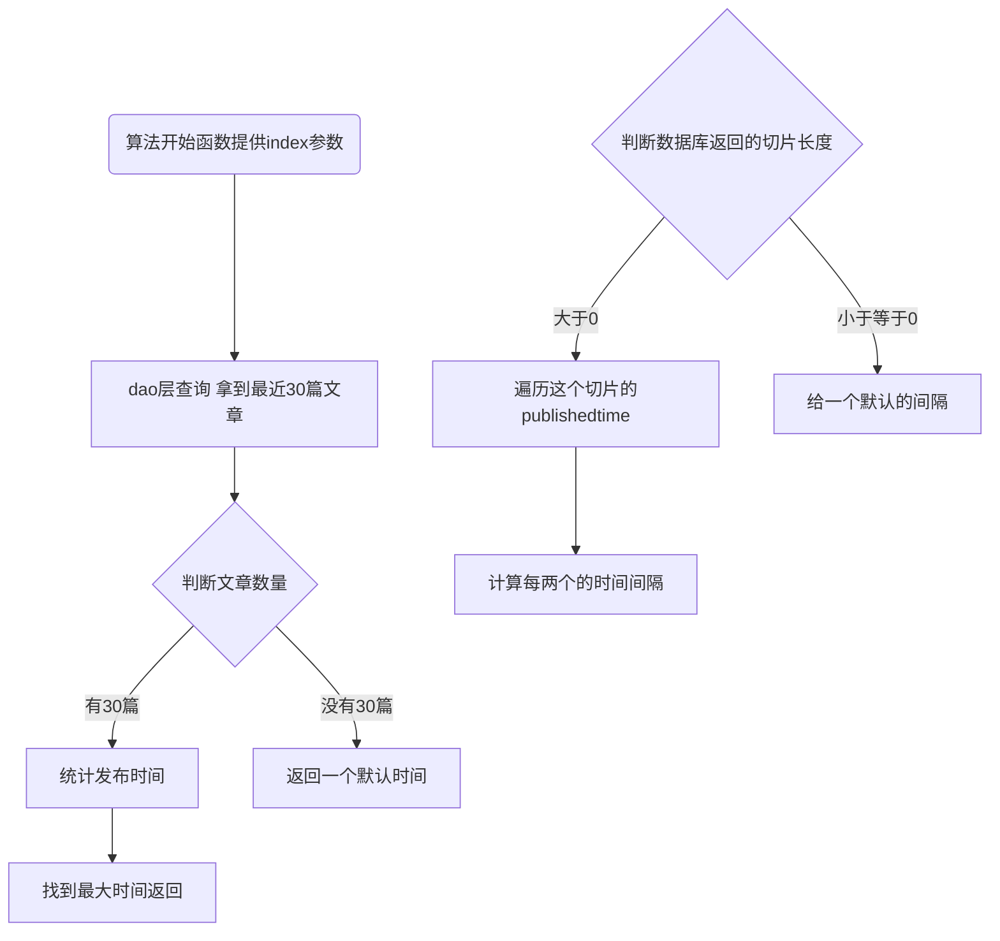

```mermaid 
graph TD 
%%主流程
cal(算法开始函数提供index参数)--> dao.query[dao层查询 拿到最近30篇文章]-->deal{判断文章数量}
deal--有30篇-->D[统计发布时间]
deal--没有30篇-->E[返回一个默认时间]
D-->F[找到最大时间返回]
%%算法核心
dao{判断数据库返回的切片长度}
dao -- 大于0-->A 
dao -- 小于等于0 -->B
B[给一个默认的间隔]
A[遍历这个切片的publishedtime]-->C[计算每两个的时间间隔]
```